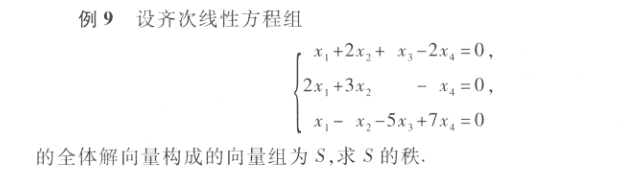
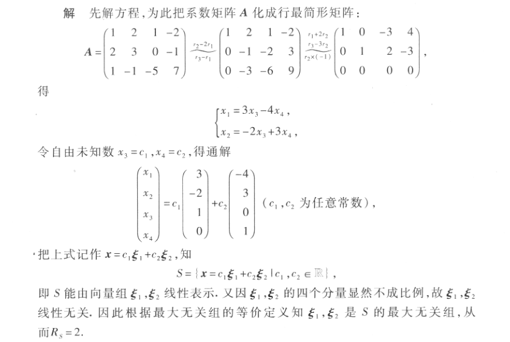
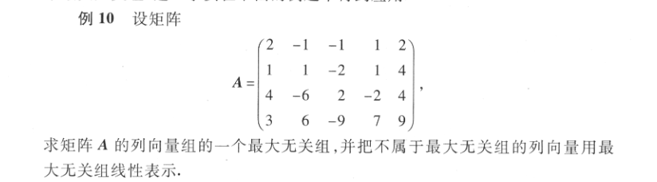
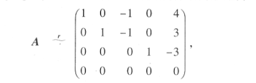

# 向量组的秩

## 最大线性无关向量组（最大无关组）
满足
- $向量组A:a_1,a_2,\cdots,a_r线性无关$
- $r+1个向量都线性无关$

**最大线性无关组向量个数就是向量组的秩**

$A_o是向量组A的一部分$
- $向量组A_o线性无关$
- $向量组A_o的任何一个向量都能由向量组A线性表示$
### 例

## 矩阵的秩等于列向量和行向量的秩

### 例

将矩阵化为最简形式

$R(A)=3$

$非零行的首元非零在a_1,a_2,a_4，那么124组成极大无关组$
