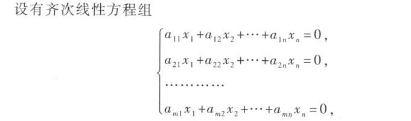
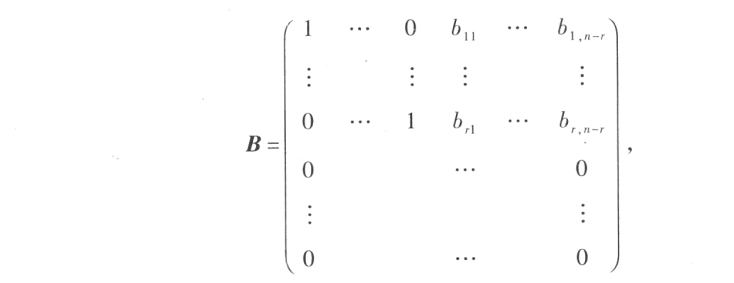
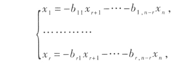
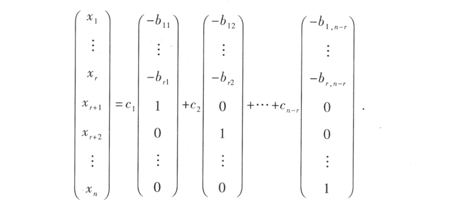
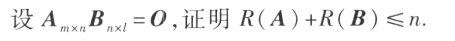
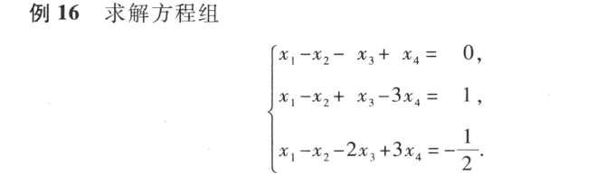
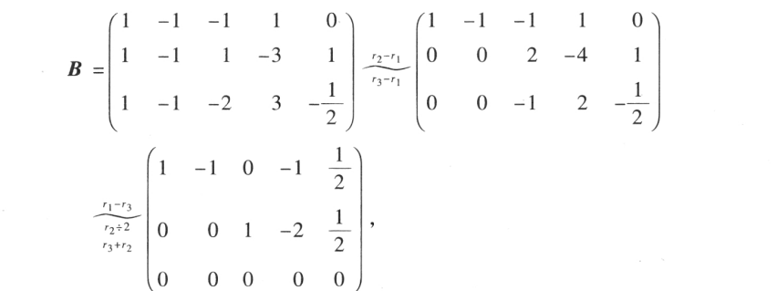
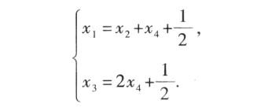
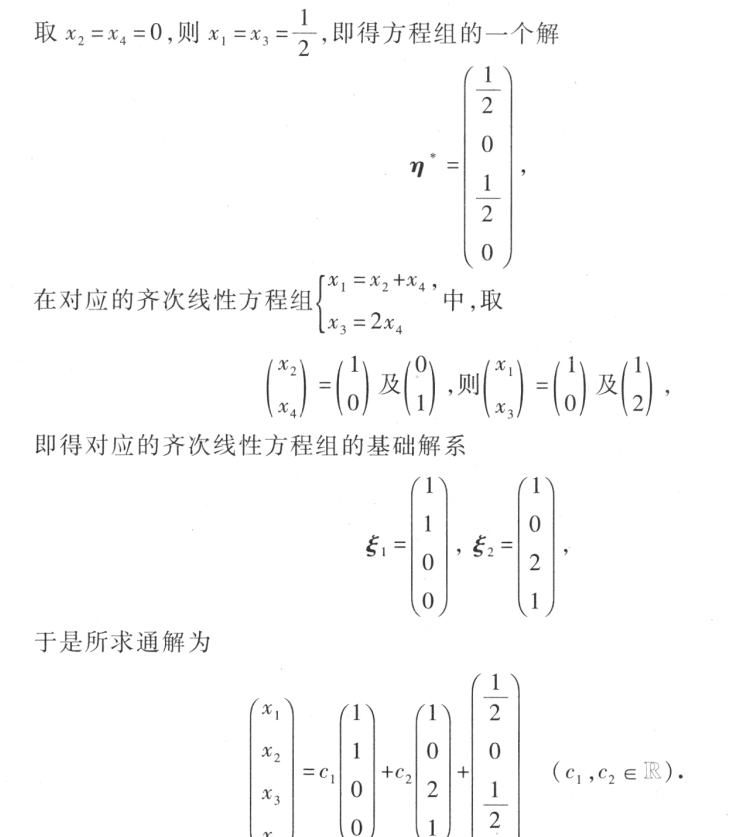

# 线性方程组的解的结构

$若x=\xi_1,x=\xi_2为向量方程的解，则x=\xi_1+\xi_2也是$

$若x=\xi为向量方程的解，则x=k\xi也是$

## 基础解系

齐次线性方程组的结集的极大无关组是该方程组的**基础解系**

$定理：设m\times n矩阵A的秩R(A)=n,则n元齐次线性方程组Ax=0的解集S的秩R_s=n-r$
### 求解基础解系
例题

设系数矩阵的秩为r，矩阵前r的列向量线性无关。

先初等变换得最简形

那么就有方程组

$x_{r+1},\cdots,x_n$作为自由未知数

$$
x=c_1\xi_1+c_1\xi_1+\cdots+c_{n-r}\xi_{n-r}
$$

任何一个解都能由基础解系线性表示

$基础解系包含n-r个向量$

### 讨论线性相关

例题

$记B=(b_1,b_2,\cdots,b_n)\\
A(b_1,b_2,\cdots,b_n)=(0,0,\cdots,0)\\
Ab_i=0\\
记方程Ab_i=0的解集S\\
b_i\in S\\
R(b_1,b_2,\cdots,b_n)\leqslant R_s\\
由定理有R(A)+R_s=n\\
R(A)+R(B)\leqslant n$

## 非齐次线性方程

非齐次方程的解=齐次方程的通解+非齐次方程的特解

性质
- $设x=\eta_1及x=\eta_2都是向量方程Ax=b的解，则x=\eta_1-\eta_2为对应的齐次线性方程组Ax=0的解（求齐次方程通解可以这样求）$

- $设x=\eta是方程Ax=b的解，x=\xi 是方程Ax=0的解，则x=\xi+\eta仍是方程Ax=b的解$

例

对增广矩阵变换为最简

$可见R(A)=R(B),方程有解$

