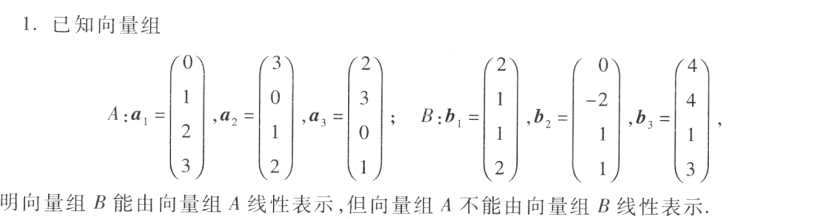
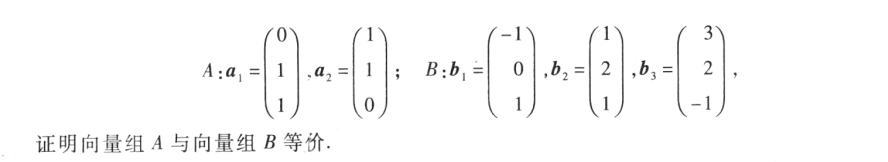
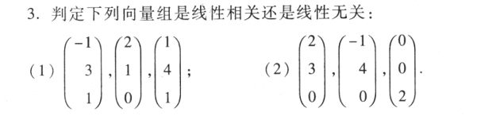
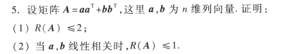
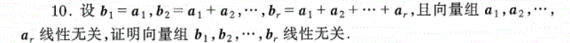
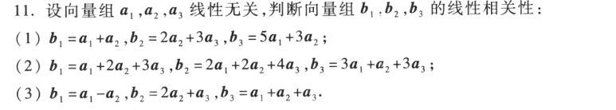

# 练习

R(A)=3,R(B)=2,所以……

证明向量组等价：能互相表示，即R(A)=R(B)=R(A,B)

$R(A)<向量个数\Leftrightarrow 向量组A线性相关\\R(A)=向量个数\Leftrightarrow 向量组A线性无关$

用到的矩阵的秩的性质S
- $R(AB)\leqslant \min\{R(A),R(B)\}$
- $R(A^T)=R(A)$
- $R(A+B)\leqslant R(A)+R(B)$

$(1)R(aa^T+bb^T)\leqslant R(aa^T)+R(bb^T)\leqslant R(a)+R(b)=2$

$(2)当a,b为O时，则A=O,结论成立；若a,b不全为零时，设a\neq 0,则b=\lambda a\\
aa^T+bb^T=(1+\lambda^2)aa^T$

$R(A)=R((1+\lambda^2)aa^T)=R(aa^T)\leqslant R(a)=1$

$(b_1,b_2,\cdots,b_n)=(a_1,a_2,\cdots,a_n)K$

$K=\begin{pmatrix}
 1&\cdots  &1 \\ 
 0& \ddots & \vdots\\
 0& 0 & 1
\end{pmatrix}$

$det(K)=1，所以K是可逆矩阵$

$根据矩阵秩的性质若P、Q可逆，则R(PAQ)=R(A)$

$R(b_1,b_2,\cdots,b_n)=R(a_1,a_2,\cdots,a_n)$

$由定理$

$R(A)<向量个数\Leftrightarrow 向量组A线性相关\\R(A)=向量个数\Leftrightarrow 向量组A线性无关$

$R(a_1,a_2,\cdots,a_n)=r,R(b_1,b_2,\cdots,b_n)=r，所以线性相关$

跟上一道题一样的做法