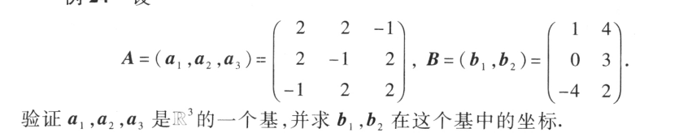
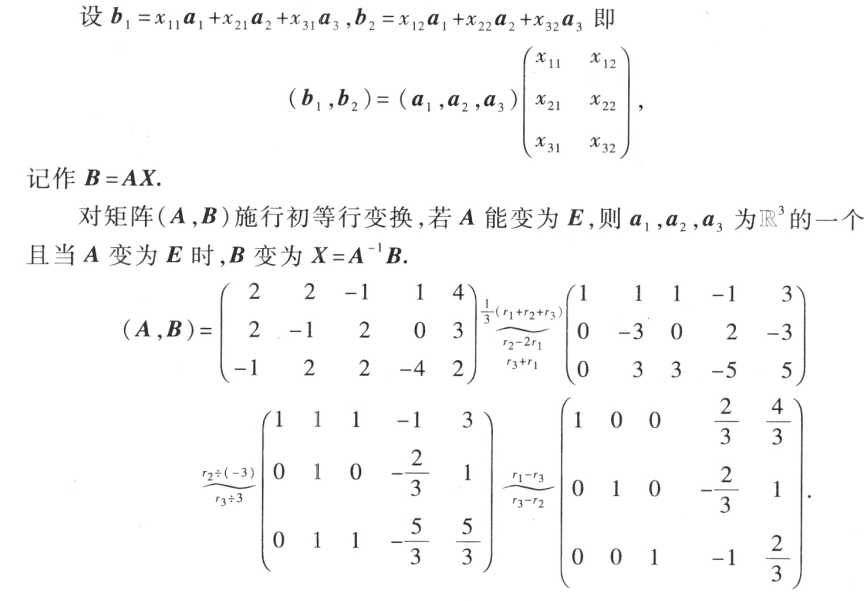
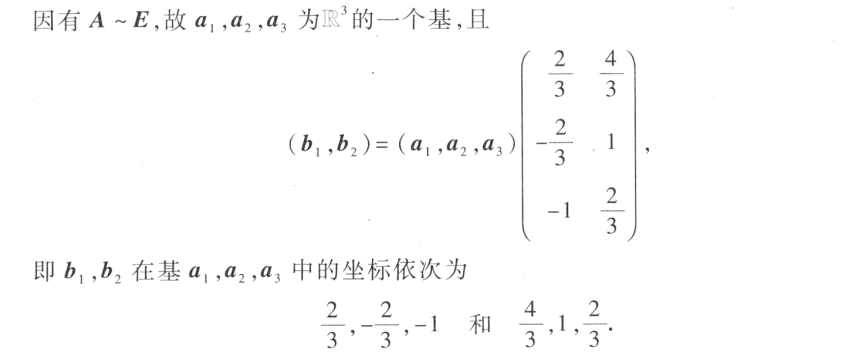
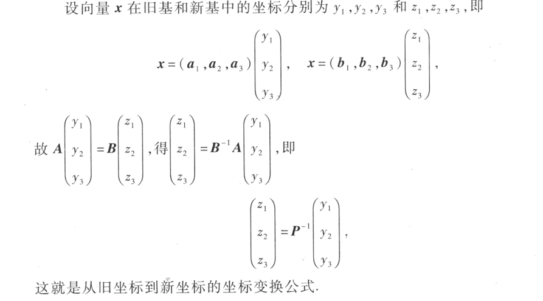
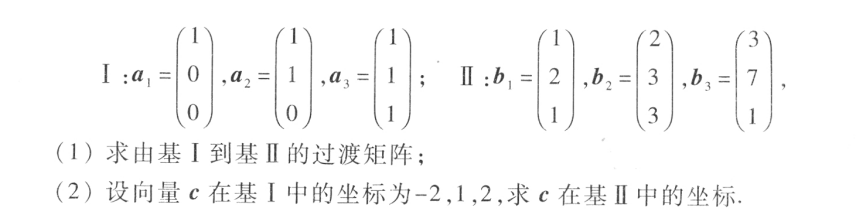

# 向量空间

$define$

$设V是n维向量的集合，如果集合V非空，且集合V对于向量的加法和数乘\\两种运算封闭，那么就称集合V为向量空间$

$封闭：在集合V中可以进行向量的加法和数乘两种运算$

## 子空间

$V_1\in V_2,V_1就是V_2的子空间$

## 基
$r个向量\in V，满足$
- 线性无关
- V中任何一个向量都可由这r个向量表示

r就是V的维数

### 自然基

单位坐标向量组成的基

例：

$要证基就是证明线性无关,即A\sim E$

### 基变换公式
$例如在\mathbb{R}^3中取两个基a_1,a_2,a_3;b_1,b_2,b_3,A=(a_1,a_2,a_3),B=(b_1,b_2,b_3)$

$基变换公式：(a_1,a_2,a_3)=(e_1,e_2,e_3)A,\qquad(e_1,e_2,e_3)=(a_1,a_2,a_3)A^{-1}\\
\qquad\qquad\qquad(b_1,b_2,b_3)=(e_1,e_2,e_3)B,\qquad(e_1,e_2,e_3)=(b_1,b_2,b_3)B^{-1}\\
(a_1,a_2,a_3)A^{-1} = (b_1,b_2,b_3)B^{-1}\\
(b_1,b_2,b_3)=A^{-1}B(a_1,a_2,a_3)
$

$其中P=A^{-1}B就称为过渡矩阵$

### 坐标变换公式 

### 例

$(1)要求过度矩阵，可以将(A,E)变换为(E,A^{-1}B)$

$(2)cAB^{-1}$

