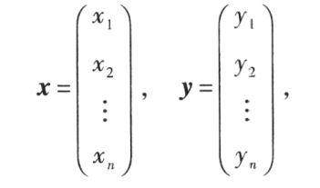
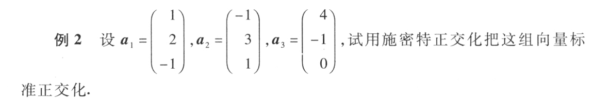
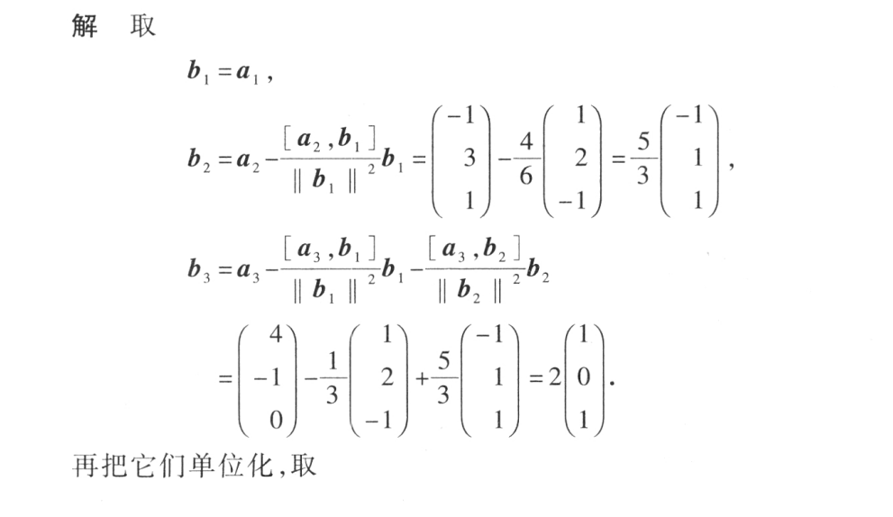
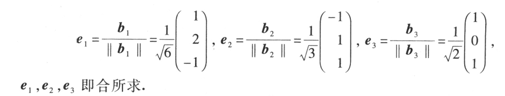

<!--
 * @Author: sitice cy1512634242@163.com
 * @Date: 2022-10-25 19:18:58
 * @LastEditors: sitice cy1512634242@163.com
 * @LastEditTime: 2022-10-25 21:45:52
 * @FilePath: \linear-algebra\相似矩阵及二次型\向量的内积、长度及正交性.md
 * @Description: 这是默认设置,请设置`customMade`, 打开koroFileHeader查看配置 进行设置: https://github.com/OBKoro1/koro1FileHeader/wiki/%E9%85%8D%E7%BD%AE
-->
<!--
 * @Author: sitice cy1512634242@163.com
 * @Date: 2022-10-25 19:18:58
 * @LastEditors: sitice cy1512634242@163.com
 * @LastEditTime: 2022-10-25 19:55:40
 * @FilePath: \linear-algebra\相似矩阵及二次型\向量的内积、长度及正交性.md
 * @Description: 这是默认设置,请设置`customMade`, 打开koroFileHeader查看配置 进行设置: https://github.com/OBKoro1/koro1FileHeader/wiki/%E9%85%8D%E7%BD%AE
-->
# 向量的内积、长度及二次型

## 内积

$$
[x,y]=x_1y_1+x_2y_2+\cdots+x_ny_n
$$

$$
[x,y]=x^{\mathrm{T}}y
$$

### 性质

- $[x,y]=[y,x]$
- $[\lambda x,y]=\lambda[x,y]$
- $[x+y,z]=[x,z]+[y,z]$
- $当x=0时，[x,x]=0；当x\neq 0时，[x,x]>0$

### 施瓦茨不等式

$$
[x,y]^2\leqslant [x,x][y,y]
$$

## 范数

$$
||x||=\sqrt{[x,x]}=\sqrt{x_1^2+x_2^2+\cdots+x_n^2}
$$

### 性质
- 非负性 $当x\neq 0,||x||>0,x=0,||x||=0$
- 齐次性 $||\lambda x||=|\lambda|\ ||x||$

### 单位向量

$||x||=1，x就为单位向量$

### 单位化

$a\neq 0,x=\frac{a}{||a||},x就为单位向量$

## 正交向量组

### 向量间的夹角

$$
\theta = \arccos \frac{[x,y]}{||x||\ ||y||}
$$

### 正交

当夹角为90°，也就是[x,y]=0时，向量正交

### 性质

- 正交向量组中的向量线性无关
- 向量空间中的基如果两两正交，那么就成为**标准正交基**
  
### 施密特正交化

将向量组标准正交化的方法

### 正交矩阵

$$
n阶矩阵A满足\\
A^{\mathrm{T}}A=E(也就是A^{-1}=A^{\mathrm{T}})
$$

$方阵A为正交矩阵的充分必要条件时A的列（行）向量都为单位矩阵，且两两相交$

所以n阶正交矩阵构成n阶向量空间的一个标准基

#### 性质
- $若A为正交矩阵，则A^{-1}和A^{\mathrm{T}}也是正交矩阵，且det(A)=1$
- $若A和B都为正交矩阵，那么AB也是$

#### 正交变换

$$
若P为正交矩阵，则线性变换y=Px称为正交变换
$$

***正交变换线段长度保持不变***

