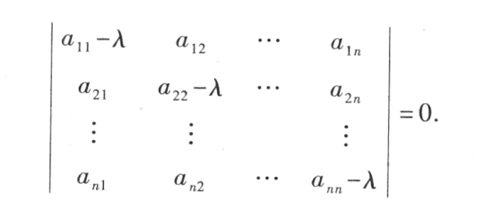
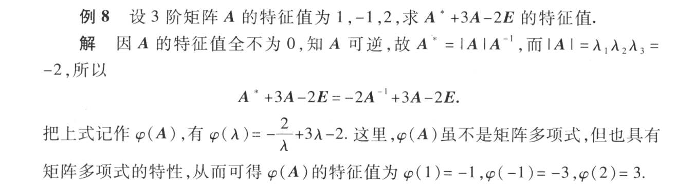
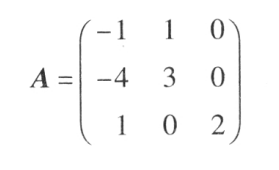
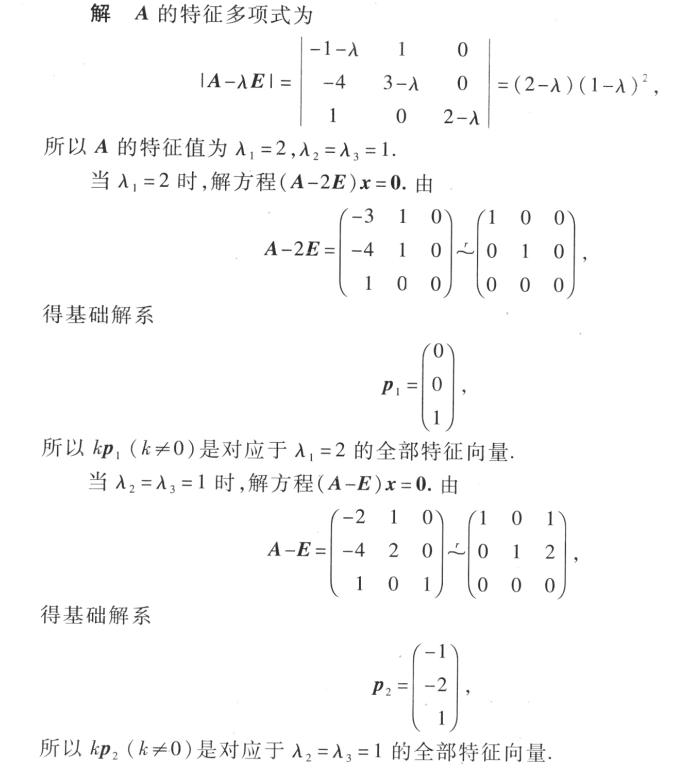

# 方阵的特征值和特征向量

$设A是n阶矩阵，如果数\lambda 和n维非零列向量x使关系式$

$$
Ax=\lambda x\ 或者(A-\lambda E)x=0
$$

$特征值：\lambda$

$特征向量：x$

$矩阵A可逆\Leftrightarrow 特征值不全为0$

要使$x$有解，那么$(A-\lambda E)=0$

矩阵在复数范围内有n个特征值

$设n阶矩阵A=(a_{ij})的特征值为\lambda_1,\lambda_2,\cdots\lambda_n$
- $\lambda_1+\lambda_2+\cdots+\lambda_n=a_{11}+a_{22}+\cdots+a_{nn}$
- $\lambda_1\lambda_2\cdots\lambda_n=|A|$

## 求解特征值和特征向量

## 特征值的性质
- $\lambda^2是A^2的特征值$

  证明：

  由$Ax=\lambda x$

  $A^2p=A(Ap)=A(\lambda p)=\lambda(Ap)=\lambda^2p$

- $当A可逆时，\frac{1}{\lambda}是A^{-1}的特征值$

  $由Ax=\lambda x$

  $有x=A^{-1}\lambda x$

  $\frac{1}{\lambda}x=A^{-1}x$

- $\lambda^k是A^k的特征值$
  
- $\varphi (\lambda)=a_0+a_1\lambda+\cdots+a_n\lambda^n是\varphi(A)=a_0E+a_1A+\cdots+a_nA^n的特征值$

## 特征向量的性质

- $设\lambda_1,\lambda_2,\cdots,\lambda_m是方阵A的m个特征值，p_1,p_2,\cdots,p_m依次是与之对应的特征向量，\\如果\lambda_1,\lambda_2,\cdots,\lambda_m各不相等，则p_1,p_2,\cdots,p_m线性无关$
- $两个不同的特征值的线性无关的特征向量组，合起来仍然线性无关$

