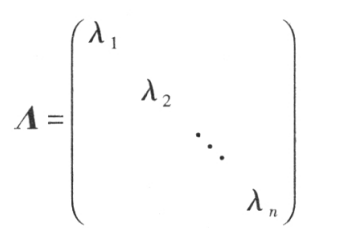
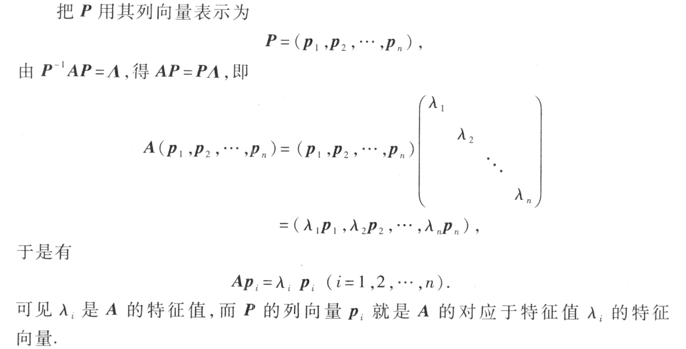
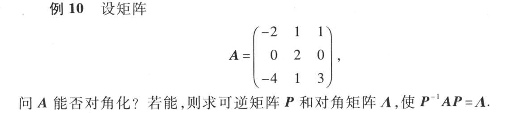
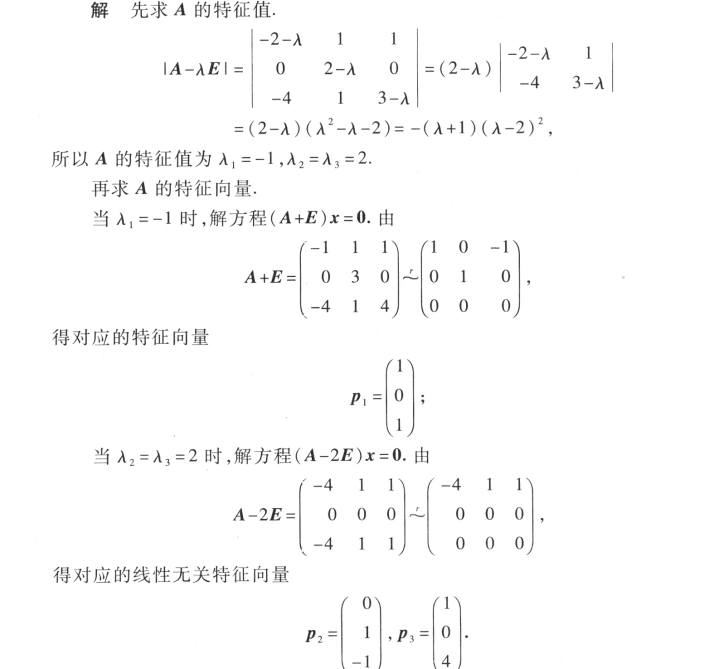
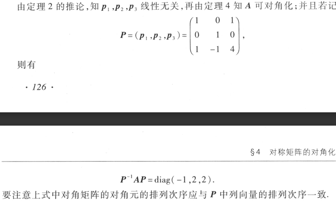

<!--
 * @Author: sitice cy1512634242@163.com
 * @Date: 2022-10-25 21:09:07
 * @LastEditors: sitice cy1512634242@163.com
 * @LastEditTime: 2022-10-25 21:45:53
 * @FilePath: \linear-algebra\相似矩阵及二次型\相似矩阵.md
 * @Description: 这是默认设置,请设置`customMade`, 打开koroFileHeader查看配置 进行设置: https://github.com/OBKoro1/koro1FileHeader/wiki/%E9%85%8D%E7%BD%AE
-->
# 相似矩阵

$define$

$$
P^{-1}AP=B
$$

$B是A的相似矩阵$

$相似变换：对A进行P^{-1}AP$

$P:相似变换矩阵$

## 性质

- $A与B相似，那么它们之间的特征值和特征向量相同$
- $若n阶矩阵A与对角矩阵\varLambda 相似，那么\lambda_1,\lambda_2,\cdots,\lambda_n是A的n个特征值$
  
  

## 对角化
### 定义
$对n阶矩阵A，找到变换矩阵P，使P^{-1}AP=\varLambda,称为把矩阵A对角化$

### 性质
*n阶矩阵A与对角矩阵相似（即A能对角化）的充分必要条件是A有n个线性无关的特征向量*

也就是

*如果n阶矩阵A的n个特征值互不相等，则A与对角矩阵相似*

### 求变换矩阵P

*P就是n个线性无关的特征向量构成*

### 例题

