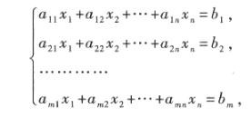
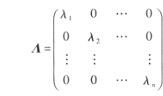
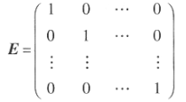

# 矩阵

**r：行**

**c：列**

**方阵：行数和列数相同**

**列矩阵：只有一列的矩阵，也叫列向量**

**行矩阵：只有一行的矩阵，也叫行矩阵**

**同型矩阵：两个的矩阵的行数和列数都相等**

**零矩阵：元素都是零的矩阵**

**矩阵相等：是同型矩阵并且元素都相同**

对于一个非线性齐次方程组

可以将其分为几个矩阵

$系数矩阵A=(a_{ij})$

$未知数矩阵x=\begin{pmatrix}
 x_{1} \\ 
 x_{2} \\
 \vdots\\ 
 x_{n} 
\end{pmatrix}$

$常系数矩阵b=\begin{pmatrix}
 b_{1} \\ 
 b_{2} \\
 \vdots\\ 
 b_{n} 
\end{pmatrix}$

$增广矩阵B=\begin{pmatrix}
 a_{11} & a_{12}&\cdots&a_{1n}&b_1\\ 
 a_{21} & a_{22}&\cdots&a_{2n}&b_2\\ 
  \vdots&  \vdots&&\vdots&\vdots\\ 
 a_{n1} & a_{n2}&\cdots&a_{nn}&b_n
\end{pmatrix}$

**对角阵**

对角阵可以写为$A=diag(\lambda_1,\lambda_2,\cdots,\lambda_n)$

**单位矩阵**

