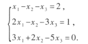

# 克拉默法则（解线性方程组）

对于n个线性方程组

$$
\left\{\begin{matrix}
 a_{11}x_1+a_{12}x_2+\cdots+a_{1n}x_n=b_1, \\ 
 a_{21}x_1+a_{22}x_2+\cdots+a_{2n}x_n=b_2,\\
 \cdots \\
 a_{n1}x_1+a_{n2}x_2+\cdots+a_{nn}x_n=b_n
\end{matrix}\right.
$$

如果线性方程组的系数矩阵$|A|\neq 0$，那么线性方程组有唯一解

$$
x_1=\frac{|A_1|}{A},\quad x_2=\frac{A_2}{A},\cdots,\quad x_n=\frac{A_n}{A}
$$

其中$A_{j}$是把系数矩阵A中第j列的元素用方程组右端的常数项代替后所得的n阶矩阵

## 例

### 法1（克拉默法则）
$|A|=5+9-4-3-10+6=3$

$|A_1|=
\begin{vmatrix}
 2 & -1& -1\\ 
 1 & -1& -3\\ 
 0 & 2 & -5
\end{vmatrix}=15$

$x_1=\frac{|A_1|}{A}=5$

$x_2=\cdots$

$x_3=\cdots$

### 法2（矩阵求逆）

$|A|\neq 0,矩阵可逆$

$x=A^{-1}b$

