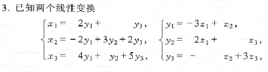
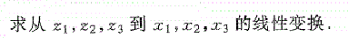
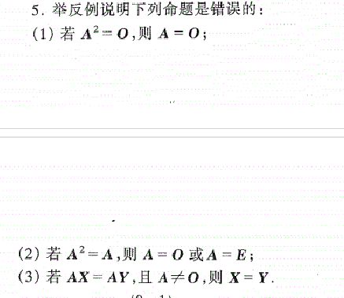
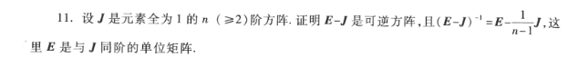
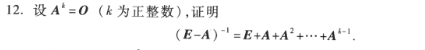
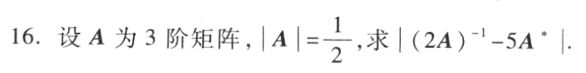

# 练习

$X=AY,Y=BZ$

$Y=A^{-1}X=BZ$

$X=ABZ$
解出x就行

这几个结论记一下

$J^n=nJ$

两边都右乘$(E-J)$

$得E=(E-\frac{1}{n-1}J)(E-J)=E-J-\frac{1}{n-1}J+\frac{1}{n-1}J^2=E$

两边都右乘$(E-A)$

**注：如果证明可逆，那么就用$AB=BA=E$**

$(2A)^{-1}-5A^*=\frac{1}{2}A^{-1}-5|A|A^{-1}=-2A^{-1}$

$|-2A^{-1}|=-2|A|^{-1}=-1$

上面这道题看一下最后那个逆矩阵得行列式

