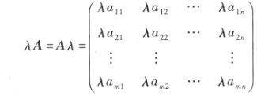
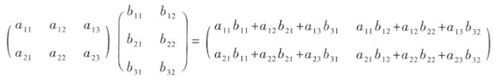

# 运算

## 加法

同型矩阵才可以相加，对应元素相加

## 数乘

### 运算规律

- $交换律(\lambda\mu)A=\lambda(\mu A)$

- $分配律(\lambda+\mu)A=\lambda A+\mu A$

- $结合律\lambda(A+B)=\lambda(A+B)$

## 矩阵相乘

左行的每一个元素分别乘以右列每一个元素然后相加

所以只有***左边列数等于右边行数***时才能相乘

### 运算规律

**矩阵的乘法不满足交换律**

对于两个方阵，如果$AB=BA$那么，称A与B是可交换的

如果两个矩阵$AB=O$不能得出$A=O$或$B=O$的结论

- $(AB)C=A(BC)$
- $\lambda (A+B)=(\lambda A)B=A(\lambda B)$
- $A(B+C)=AB+AC,\quad (B+C)A=BA+CA$
- $E_mA_{m\times n}=A_{m\times n}, \quad A_{m\times n}E_m=A_{m\times n}(一个矩阵乘以单位阵等于它本身)$

那么单位阵就相当于数1

## 矩阵的幂

只有方阵才有幂

### 运算规律

- $A^kA^l=A^{k+l}$
- $(A^k)^l=A^{kl}$

当A与B可交换时

- $(AB)^k=A^kB^k$
- $(A+B)^2=A^2+B^2+2AB$
- $(A+B)(A-B)=A^2-B^2$

## 矩阵的转置

矩阵$A$的转置$A^\mathrm{T}$

转置就是将矩阵内元素的行和列交换

例如
$A=\begin{pmatrix}
 1 & 2 & 0 \\ 
 3 & -1 &1
\end{pmatrix}$

$A^\mathrm{T}=\begin{pmatrix}
1 & 3\\
2 & -1\\
0 & 1
\end{pmatrix}$

### 运算规律

- $(A^\mathrm{T})^\mathrm{T}=A$
- $(A+B)^\mathrm{T}=A^\mathrm{T}+B^\mathrm{T}$
- $(\lambda A)^\mathrm{T}=\lambda A^\mathrm{T}$
- $(AB)^\mathrm{T}=B^\mathrm{T}A^\mathrm{T}$

### 对称阵
满足$A^\mathrm{T}=A$，即$a_{ij}=a_{ji}$，元素以对角线为对称轴对于相等

## 方阵的行列式

$\mathrm{det}(A)或|A|$

### 运算规律
- $|A^\mathrm{T}|=|A|$
- $|\lambda A|=\lambda^n|A|$
- $|AB|=|A||B|$

