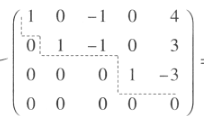
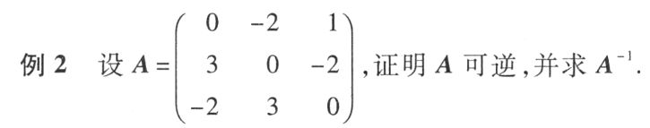

# 初等变换

- 对换两行
- 以数k（k不等于0）乘以某一行的所有元
- 把某一行的k倍所有元加到另一行的对应元上去
以上对列也适用

## 矩阵的等价

经过有限次初等变换之后A矩阵变为B矩阵，那么A与b等价

$A\sim B：A与B等价$

$A \sim^r B：A与B行等价（有限次行变换）$

$A \sim^c B：A与B列等价（有限次列变换）$

### 性质
- $反身性\quad A\sim A$
- $对称性\quad 若A\sim B，则B\sim A$
- $传递性\quad 若A\sim B,B\sim C,则 A\sim C$

## 行阶梯形矩阵

### 行最简形矩阵

- 首先满足行阶梯形
- 每一行第一个不是零的元素都是1
- 每一行第一个不是零的元素所在列其他元素都为0

### 标准型

对于$m\times n$矩阵，总可以通过初等变换将它化为标准型

$$
F=\begin{pmatrix}
 E_r & O\\
 O & O
\end{pmatrix}_{m\times n}
$$

## 定理
$设 A 与 B 为 m×n 矩阵，那么$
- $A \sim^r B的充分必要条件是存在 m 阶可逆矩阵 P，使 PA = B（左乘）$
- $A \sim^c B 的充分必要条件是存在 n 阶可逆矩阵 Q，使 A Q = B（右乘）$
- $A \sim B 的充分必要条件是存在 m 阶可逆矩阵 P 及 n 阶可逆矩阵Q,使PAQ=B$

## 初等矩阵

由单位矩阵进行初等变换得到的矩阵称为初等矩阵

### 性质
- $对矩阵A(m\times n)进行初等行变换就相当于对A左乘一个m阶的初等矩阵；列变换，右乘n阶$
- $方阵可逆的充要条件是存在有限个初等矩阵P_1,P_2,\cdots,P_l，使A=P_1P_2\cdots P_l（这个不是很重要）$

### 证明方阵可逆
$方阵A可逆的充要条件是A\sim^r E$

### 方阵求逆的另一种方法

$定理表明，如果A\sim^r B，即A经过一系列初等行变换变为B，则有可逆矩阵P，使PA=B$

这里的B可以是任何目标矩阵，比如为E，那么就是求逆（一般A为方阵时才是求逆）；这种方法也可以用来求可逆矩阵P（一般为此时B为A的最简形式）

$由于PA=B\Leftrightarrow \left\{\begin{matrix}
 PA=B, \\ 
 PE=P 
\end{matrix}\right.\Leftrightarrow P(A,E)=(B,P)\Leftrightarrow (A,E)\sim^r (B,P)$

$在这里只需要B是E，那么PA=E，P就为A^{-1}$

### 例

$(A,E)=\begin{pmatrix}
 0 & -2 & 1 &1&0&0\\ 
 3 & 0 & -2 &0&1&0\\
 -2 & 3 & 0 &0&0&1
\end{pmatrix}化为(E,B)的形式，那么B就是A^{-1}$

