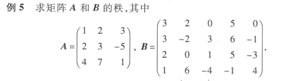
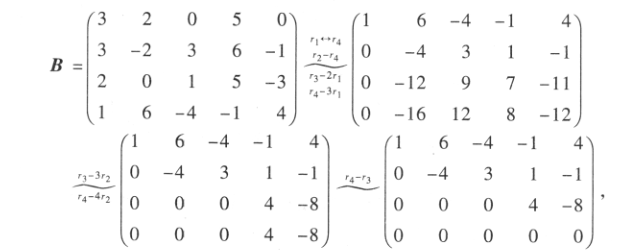
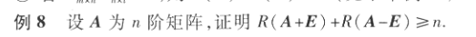
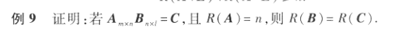
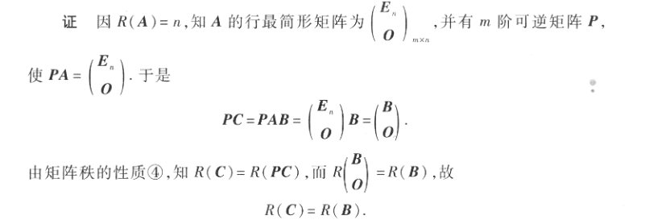

# 矩阵的秩

矩阵A的**列秩**是A的*线性独立*的**纵列**的极大数，表示为$r(A),R(A)或者rank(A)$

## 初等变换不改变矩阵的秩

## 计算矩阵的秩 

$方阵的行秩和列秩总是相等$

$m \times n矩阵的秩最大为m和n中较小的那个，表示为\min(m,n)$

$矩阵A的k阶子式：任取A中的k行和k列，\\将这k^2个元素按照在A中位置次序排列成一个行列式（不重要）$

$那么m\times n矩阵A就有C_m^k\cdot C_n^k个（不重要）$

$R(A)=最大非零子式（当矩阵为行阶梯形，就看非全为0的行数）$

废话不多说，上例子

$容易看出|A|=0，而\begin{vmatrix}
 2 & 3 \\ 
 4& 7 
\end{vmatrix}=2，所以R(A)=2（因为三阶子式等于0，所以看二阶子式是否都为零）$

*对于阶数较少的矩阵可以这样算,阶数较多的将其化为行阶梯形矩阵*

$R(B)=3$

## 满秩矩阵：可逆矩阵

## 降秩矩阵：不可逆矩阵（奇异矩阵）

## 性质
- $0\leqslant R(A_{m\times n})\leqslant \min \{m,n\}$
- $R(A^T)=R(A)$
- $若A\sim B,则R(A)=R(B)$
- $若P、Q可逆，则R(PAQ)=R(A)$
- $\max \{R(A),R(B)\}\leqslant R(A,B)\leqslant R(A)+R(B)\\当B=b为非零向量时R(A)\leqslant R(A,b)\leqslant R(A)+1$
- $R(A+B)\leqslant R(A)+R(B)$
- $R(AB)\leqslant \min\{R(A),R(B)\}$
- $若A_{m\times n}B_{n \times l}=O,则R(A)+R(B)\leqslant n$

$由于(A+E)+(E-A)\\
根据性质R(A+B)\leqslant R(A)+R(B)\\
R(A+E)+R(E-A)\geqslant R(2E)=n\\
又因为R(A+E)=R(E-A)\\
R(A+E)+R(E-A)\geqslant n
$

