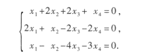
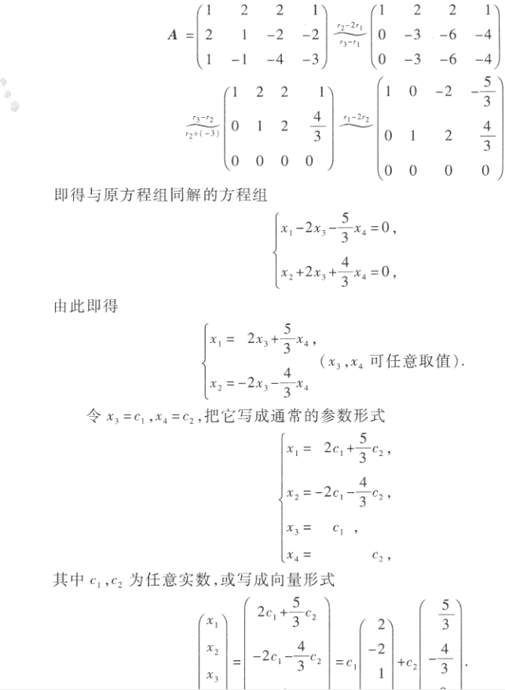
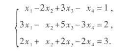
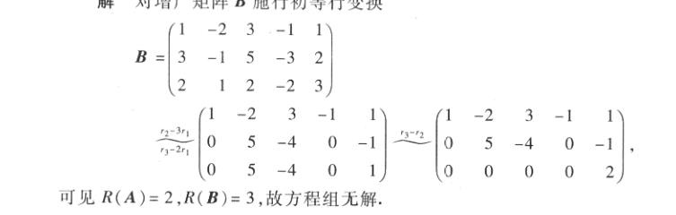
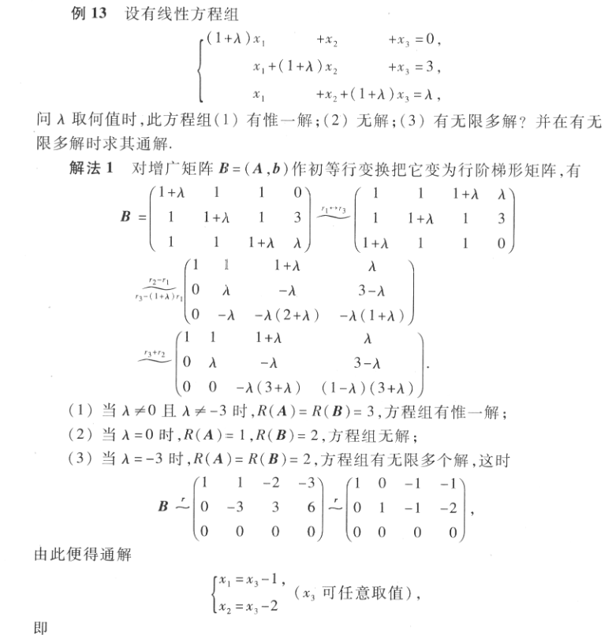
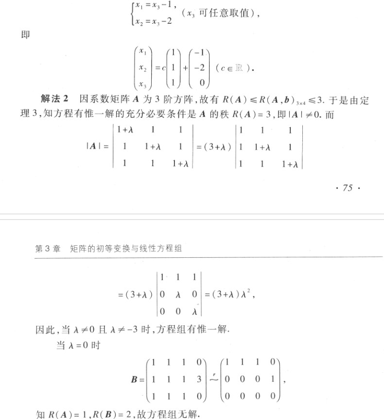
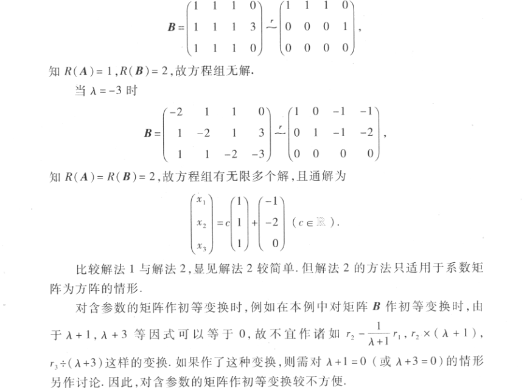

# 线性方程组的解

## 对于线性方程组Ax=b
- $无解的充要条件时R(A)< R(A,b)$
- $有唯一解的充要条件是R(A)=R(A,b)=n$
- $有无限多个解的充要条件是R(A)=R(A,b)<n$
- $n元齐次方程组Ax=0有非零解的充要条件是R(A)<n$
- $线性方程组有解的充要条件是R(A)=R(A,b)$
- $矩阵方程AX=B有解的充要条件是R(A)=R(A,B)$
- $设AB=C，则R(C)\leqslant \min\{R(A),R(B)\}$

## 例
求解线性方程组

先将系数矩阵化为最简形式

求线性方程组

对增广矩阵初等变换

