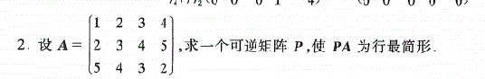
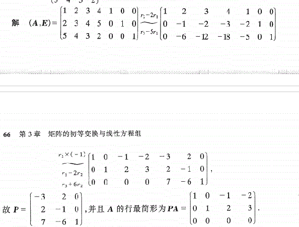
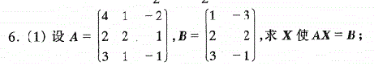
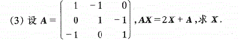
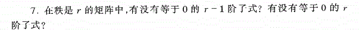

虽然这道题可以直接将A的逆求出来再与B相乘，但是，有一个简单的方法，方法跟上面的方法一样

$A^{-1}A=E\\
A^{-1}(A,B)=(E,A^{-1}B)$

$(A,B)化为(E,A^{-1}B),只要把左边化为E，那么右边就为A^{-1}B$

$(A-2,A)化为(E,(A-2)^{-1}A),\\只要把左边化为E，那么右边就为(A-2)^{-1}A$

都有可能有，也可能没有

