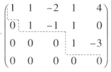
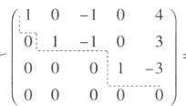
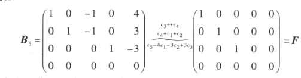

# 初等变换

- 对换两行
- 以数k（k不等于0）乘以某一行的所有元
- 把某一行的k倍所有元加到另一行的对应元上去
以上对列也适用

## 矩阵的等价

经过有限次初等变换之后A矩阵变为B矩阵，那么A与b等价

$A\sim B：A与B等价$

$A \sim^r B：A与B行等价（有限次行变换）$

$A \sim^c B：A与B列等价（有限次列变换）$

### 性质
- $反身性\quad A\sim A$
- $对称性\quad 若A\sim B，则B\sim A$
- $传递性\quad 若A\sim B,B\sim C,则 A\sim C$

## 行阶梯形矩阵

### 行最简形矩阵

- 首先满足行阶梯形
- 每一行第一个不是零的元素都是1
- 每一行第一个不是零的元素所在列其他元素都为0

### 标准型

对于$m\times n$矩阵，总可以通过初等变换将它化为标准型

$$
F=\begin{pmatrix}
 E_r & O\\
 O & O
\end{pmatrix}_{m\times n}
$$

## 定理
$设 A 与 B 为 m×n 矩阵，那么$
- $A \sim^r B的充分必要条件是存在 m 阶可逆矩阵 P，使 PA = B（左乘）$
- $A \sim^c B 的充分必要条件是存在 n 阶可逆矩阵 Q，使 A Q = B（右乘）$
- $A \sim B 的充分必要条件是存在 m 阶可逆矩阵 P 及 n 阶可逆矩阵Q,使PAQ=B$
