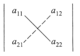
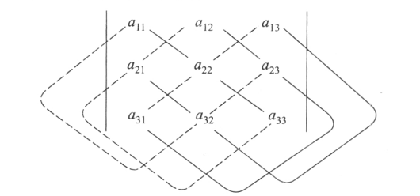

# 行列式

## 二阶行列式

对角线法则

$\begin{vmatrix}
 a_{11} & a_{12}\\ 
 a_{21}& a_{22}  
\end{vmatrix}$

$二阶行列式的值=a_{11}a_{22}-a_{12}a_{21}$

## 三阶行列式

$\begin{vmatrix}
 a_{11} & a_{12}& a_{13}\\ 
 a_{21}& a_{22}& a_{23} \\ 
 a_{31}& a_{32}& a_{33} 
\end{vmatrix}$

$二阶行列式的值=a_{11}a_{22}a_{33}+a_{12}a_{23}a_{31}+a_{13}a_{21}a_{32}-a_{13}a_{22}a_{31}-a_{12}a_{21}a_{33}-a_{11}a_{32}a_{23}$