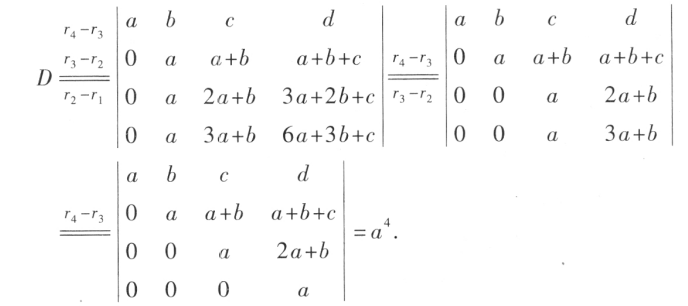

# 性质

- 行列式和他的转置相等
- 对换两列（行）行列式变号
- 两列行列式完全相同，行列式等于0
- 行列式某一行所有元素乘以k，行列式的值乘以k
- 行列式某一行的公因数可以提出来
- 行列式某两行成比例，行列式等于0
- 行列式某一行的各元素乘以一个数然后加到另一行，行列式的值不变
  

## 例1

解法，将它变换到上或者下三角，对换上下两行

一共$(n-1)+(n-2)+\cdots+1=\frac{1}{2}n(n-1)等差数列$

$D_1=a_{11}a_{22}\dots a_{nn}对角线$

$D=(-1)^{n-1}D_1$

一样的操作

## 例2

解法：变换为上三角形式  

## 例3

各行相加都是6，将每一行都加到第一行，然后其余行都减去第一行

 

## 例4

从第四行开始后行逐步减去前行

注意：上面很多运算都写在了一起，但次序并不能颠倒

## 例5

$D=D_1D_2$

