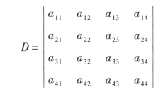
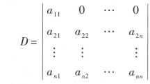
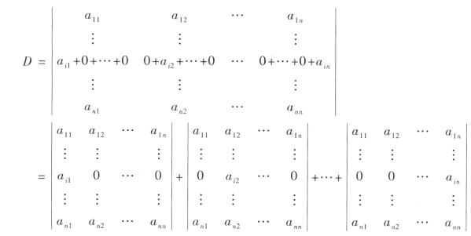
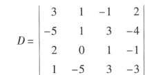
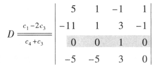
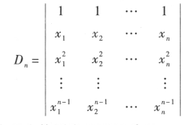

# 行列式按行（列）展开

## 余子式

$概念：在n阶行列式中，把(i,j)元a_{ij}所在的第i行和第j列划去后，\\留下的行列式叫做a_{i,j}的余子式,记M_{ij}$

$$
代数余子式\quad A_{ij}=(-1)^{i+j}M_{ij}
$$

例如

余子式

代数余子式

$A_{32}=(-1)^{3+2}M_{32}=-M_{32}$

## 行列式的计算

如果一个行列式中某一行（列）只有一个元素不是零，那么行列式的值就为这个这个元素乘以它的的代数余子式

$D=a_{11}A_{11}$

行列式是可以拆分的

所以行列式的值

$$
D=a_{1j}A_{1j}+a_{2j}A_{2j}+\cdots+a_{nj}A_{nj}\quad (j
=1,2,\cdots,n)
$$

### 例题

保留$a_{33}$，运用行列式的性质将其他元素都变为零

$A_{33}=(-1)^{3+3}\begin{vmatrix}
 5 & 1& 1\\ 
 -11& 1& -1 \\ 
 -5&-5& 0 
\end{vmatrix}$

对于三阶行列式

$M_{33}=0+5+55+5-25=40$

$A_{33}=40(-1)^{3+3}=40$

## 范德蒙德行列式

$D=\prod_{n\geqslant i>j\geqslant 1}(x_i-x_j)$

## 推论.
行列式某一行（列）的元素与另一行（列）的对应元素的代数余子式乘积之和等于零

$$
a_{i1}A_{j1}+a_{i2}A_{j2}+\cdots +a_{in}A_{j1n}=0,i\neq j
$$

## 综上所诉代数余子式的性质

$$

\sum_{k=1}^n a_{ki}A_{kj}=\left\{\begin{matrix}
 D  \quad当i=j \\ 
  0  \quad当i\neq j
\end{matrix}\right.

$$
