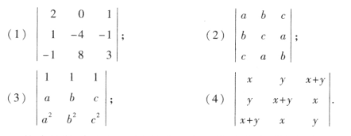
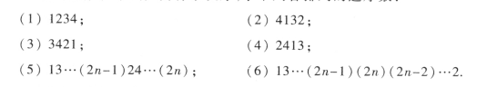
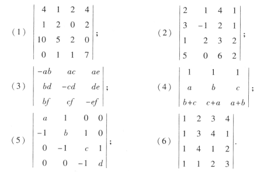
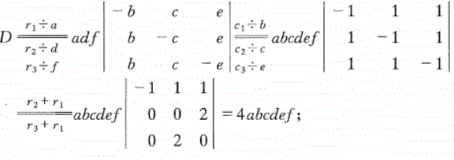
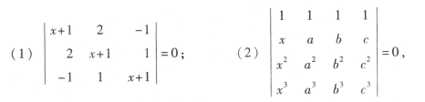
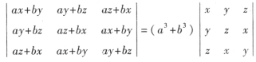
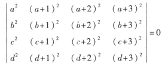
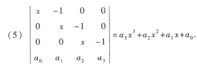

# 习题

## 利用对角线法则计算行列式

### (1)

$D=-24+0+8-4-0+16=-4$

### (2)

$D=abc+abc+abc-c^3-b^3-a^3$

### (3)

$方法一：利用对角线法则\quad D=bc^2+ca^2+ab^2-a^2b-ac^2-b^2c=(b-a)(c-b)(c-a)$

$方法二：范德蒙德行列式\quad D=\prod_{n\geqslant i>j\geqslant 1}(x_i-x_j)\\
n=3\\
D=(b-a)(c-b)(c-a)$

### (4)

$方法一：利用对角线法则\quad D=3xy(x+y)-(x+y)^3-x^3-y^3=-2(x^3+y^3)$

## 求逆序数

### (1)

$0$

### (2)

$1+1+2=4$

### (3)

$0+2+3=5$

### (4)

$0+2+1=3$

### (5)

$(n-1)+(n-2)+(n-3)+\cdots+0=\frac{1}{2}[n(n+1)]$

### (6)

$2+4+\cdots+[2(n-1)]=n(n+1)$

## 四阶行列式含有因子$a_{11}a_{23}$的项

$a_{11}a_{23}a_{32}a_{44}$

$-a_{11}a_{23}a_{34}a_{42}$

## 计算下面的行列式

### (1) 化简为上三角

### (2) 化简为上三角

### (3)

### (4)
化简为上三角，没什么算的，忽略

### (5)
代数余子式算

### (6)
化简就行

## 求解下面

### (1)
忽略
### (2) 

范德蒙德行列式

## 证明
### (2)

$left=a\begin{vmatrix}
 x & ay+bz& az+bx\\ 
 y&\cdots &  \\ 
 z&\cdots& 
\end{vmatrix}+
b\begin{vmatrix}
 x &ay+bz& az+bx \\ 
 y&\cdots &  \\ 
 z&\cdots& 
\end{vmatrix}=aD_1+bD_2$

$D_1=\begin{vmatrix}
 x & ay+bz& az+bx\\ 
 y&az+bx &ax+by  \\ 
 z&ax+by&ay+bz& 
\end{vmatrix}\xrightarrow[c_3\div a]{c_3-bc_1}a\begin{vmatrix}
 x & ay+bz& z\\ 
 y&az+bx &x  \\ 
 z&ax+by&y& 
\end{vmatrix}$

### (3)

其他列减去第一列

### (5)

代数余子式求

